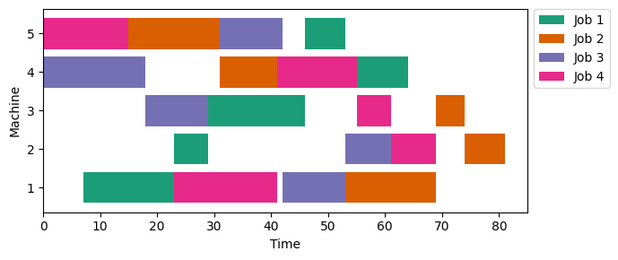
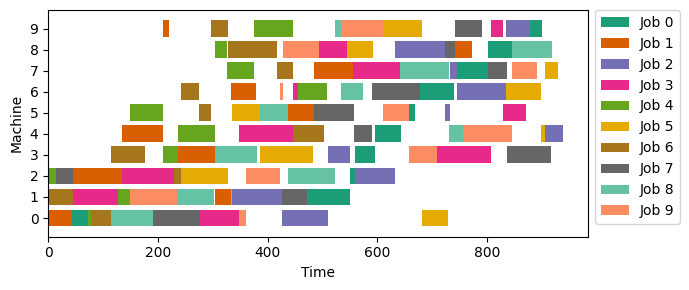
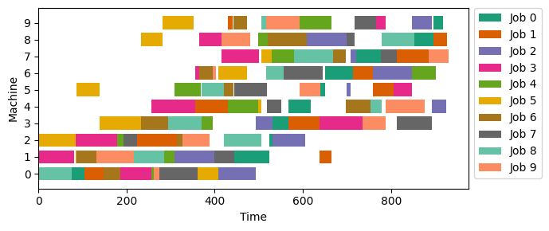

# jobshop 
Python package for modeling the job-shop scheduling problem using mixed-integer programming (MIP) and meta-heuristics.

See here [MIP](#mip) and [Metaheuristics](#metaheuristics) examples.

## Install

First, make sure you have a Python 3 environment installed.

From the current version on github:
```
pip install git+https://github.com/bruscalia/jobshop
```

## Problems

In this framework, problems are defined by ``JobShopParams`` instances. There is available a random generator and a convenience to instantiate problems from the literature using the ``from jobshop.params import job_params_from_json`` interface. Json files are available for some instances [here](./instances/orlib).

```python
from jobshop.params import JobShopRandomParams
from jobshop.params import job_params_from_json
```

## MIP

Let us see an example of how to implement the disjunctive model for the job-shop problem, described by the equations below. Those interested in a detailed review of MIP formulations to the job-shop problem can refer to [Ku & Beck (2016)](#mipjssp). An additional notebook with a comparison between the disjunctive and time-indexed models can be found [here](./notebooks/mip_models.ipynb).

```python
import numpy as np
import pyomo.environ as pyo
from jobshop.params import JobShopRandomParams
from jobshop.mip import DisjModel
```

```python
params = JobShopRandomParams(5, 4, t_span=(5, 20), seed=12)
disj_model = DisjModel(params)

solver = pyo.SolverFactory("cbc", options=dict(cuts="on", sec=20))
print(solver.solve(disj_model, tee=True))
```

```python
disj_model.plot()
```




## Metaheuristics

The problem can be formulated using logical relationships between elements, in which we must define the starting time $t$ of each operation $\sigma_{k}^j$ of processing time $p$. For more details of this formulation or [GRASP and GRASP-PR](#grasp) implementation, we suggest referring to [Aiex et al. (2003)](#graspprjssp). For more details of the [BRKGA](#brkga) decoding process, one can refer to [Gonçalves & Resende (2014)](#brkgajssp).

$$
\begin{align}
    \text{min} \quad & C_{max} \\
    \text{s.t.} \quad & t(\sigma_{k}^j) + p(\sigma_{k}^j) \leq C_{max}
        & \forall ~ \sigma_{k}^j \in O \\
    & t(\sigma_{l}^j) + p(\sigma_{l}^j) \leq t(\sigma_{k}^j)
        & \forall ~ \sigma_{l}^j \prec \sigma_{k}^j \\
        & \begin{split}
            & t(\sigma_{l}^i) + p(\sigma_{l}^i) \leq t(\sigma_{k}^j) ~\lor \\
            & t(\sigma_{k}^j) + p(\sigma_{k}^j) \leq t(\sigma_{l}^i)
        \end{split} & \forall ~ \sigma_{k}^j, \sigma_{l}^i \in O, ~ M_{\sigma_{k}^j} = M_{\sigma_{l}^i} \\
    & t(\sigma_{k}^j) \geq 0 & \forall ~ \sigma_{k}^j \in O \\
\end{align}
$$

### GRASP

Now consider the instance *mt10*, a 10x10 problem from the literature. This problem has a known optimal solution of 930, although 950 is already a challenging target.

```python
from jobshop.params import job_params_from_json
from jobshop.heuristic.grasp import GRASP, GRASPPR
```

```python
params = job_params_from_json("./instances/orlib/mt10.json")
```

```python
# Pure GRASP (fast solutions with lower quality)
grasp = GRASP(params, alpha=(0.4, 1.0), seed=42)
sol_grasp = grasp(100000, target=None, verbose=True)
print(sol_grasp.C)
```

```python
# GRASP-PR
grasp_pr = GRASPPR(params, alpha=(0.4, 1.0), maxpool=20, post_opt=True, ifreq=20000)
sol_pr = grasp_pr(100000, verbose=True, seed=42, target=930)
print(sol_pr.C)
```

These configurations would return solutions with makespan of 980 for GRASP and 938 for GRASP-PR, although the latter would take several hours to be obtained.

```python
sol_pr.plot()
```



### BRKGA

Let us once again consider problem *mt10* and re-use the previously defined ``params`` instance. Those interested in understanding better the mechanisms of BRKGA might refer to [this presentation](http://www.decom.ufop.br/prof/marcone/Disciplinas/InteligenciaComputacional/brkga.pdf).

```python
from pymoo.optimize import minimize
from jobshop.params import job_params_from_json
from jobshop.heuristic.brkga import BRKGA, LSDecoder, JobShopProblem, PhenoDuplicates
from jobshop.heuristic.brkga.termination import TargetTermination
```

```python
brkga = BRKGA(
    pop_size=150,
    perc_elite=0.2,
    perc_mutants=0.1,
    bias=0.85,
    eliminate_duplicates=PhenoDuplicates(min_diff=0.1),
)
problem = JobShopProblem(params, LSDecoder)
res = minimize(problem, brkga, termination=TargetTermination(1000, 930), verbose=True, seed=42)
```

```python
graph = problem.decoder.build_graph_from_string(res.X)
print(graph.C)
```

Using this configuration, BRKGA would find the optimal solution within approximatedely 90 minutes, although good quality solutions (lesser than 970) could be found within a few minutes.

```python
graph.plot()
```




## References

<a id="graspprjssp"></a> 
Aiex, R. M., Binato, S., & Resende, M. G. (2003). Parallel GRASP with path-relinking for job shop scheduling. Parallel Computing, 29(4), 393-430.

<a id="brkgajssp"></a> 
Gonçalves, J. F., & Resende, M. G. (2014). An extended Akers graphical method with a biased random‐key genetic algorithm for job‐shop scheduling. International Transactions in Operational Research, 21(2), 215-246.

<a id="mipjssp"></a> 
Ku, W. Y., & Beck, J. C. (2016). Mixed integer programming models for job shop scheduling: A computational analysis. Computers & Operations Research, 73, 165-173.